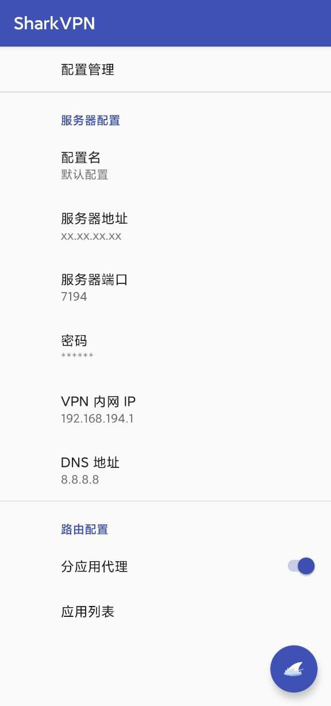

# Shark VPN 安卓客户端

## 使用方法

### 1. 部署Linux服务端

详见: [shark-vpn-server](https://github.com/shark-vpn/shark-vpn-server)


### 2. 客户端使用

```sh
git https://github.com/shark-vpn/shark-client-android

使用 Android Studio 3.6.1 构建app
安装 app 后点击右下角的按钮即可.

```



